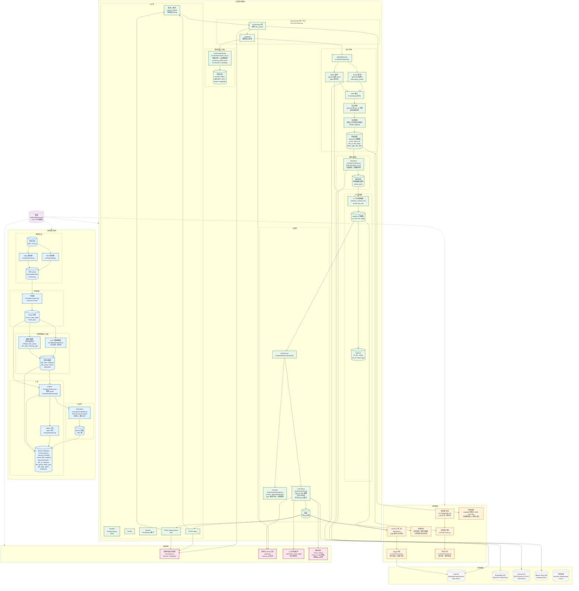
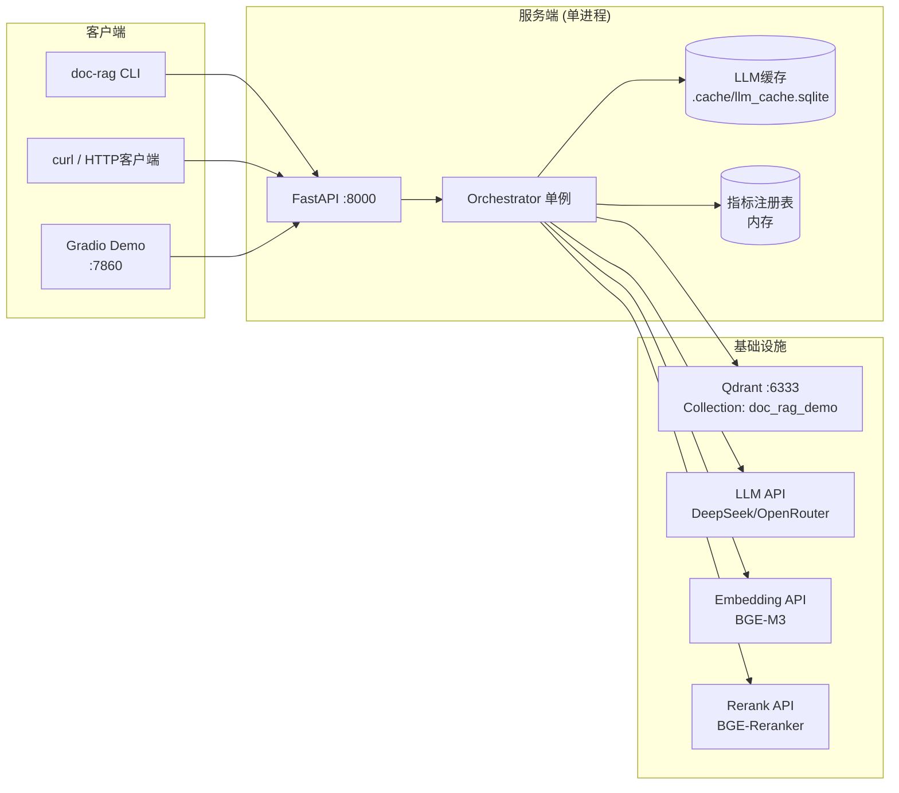

# Doc-RAG 运行时架构图

## 系统概览



## 关键数据流

### 1. 离线摄入流 (Ingestion Pipeline)

```
data/raw/*.pdf,*.docx
       │
       ▼
┌──────────────────┐
│  pipeline.run()  │  ← 双路由：.pdf → extract_pdf, .docx/.doc → extract_office
└────────┬─────────┘
         │ IntermediateDoc (schema.py)
         ▼
┌──────────────────┐
│  chunk_by()      │  ← structural (标题层级) / fixed (固定大小)
└────────┬─────────┘
         │ List[Chunk]
         ▼
┌──────────────────┐     ┌──────────────────┐
│  extract_metadata() │  │  base_meta()     │  ← LLM 抽取 (可选, --llm-meta) / 文件名启发式
└────────┬─────────┘     └────────┬─────────┘
         │                        │
         └──────────┬─────────────┘
                    ▼
         ┌──────────────────┐
         │  embedder.embed()│  ← BGE-M3, 批量 32, 重试 3 次, 维度校验 1024
         └────────┬─────────┘
                  │ dense vectors
                  ▼
         ┌──────────────────┐
         │ index_parsed()   │  ← 幂等 upsert: 删旧块 → 批量 64 upsert
         │  - dense vector  │
         │  - bm25 Document │  ← jieba 分词文本 + qdrant/bm25 模型
         │  - payload indexes│
         └────────┬─────────┘
                  │
                  ▼
         Qdrant Collection: doc_rag_demo
         - vectors: dense (COSINE), bm25 (IDF)
         - payload indexes: doc_id, category, doc_group, block_type, doc_date, topics, attendees
```

### 2. 在线查询流 (Online Query Pipeline)

```
POST /query {question, kb?, top_n?}
       │
       ▼
┌──────────────────┐
│ require_token()  │  ← 鉴权 + 限流 (滑动窗口, 进程内)
└────────┬─────────┘
         │
         ▼
┌──────────────────┐
│ Orchestrator.answer() │  ← 单例 (lru_cache), 无跨请求可变状态
└────────┬─────────┘
         │
         ▼
┌──────────────────┐
│ _prepare()       │  ← 核心编排: rewrite → retrieve → rerank → truncate
└────────┬─────────┘
         │
    ┌────┴────┐
    ▼         ▼
[use_rewrite] [use_rewrite=False]
    │            │
    ▼            ▼
┌─────────┐  ┌─────────────────┐
│LLMQuery │  │ plan = {        │
│Rewriter │  │  rewritten: q,  │
│         │  │  filters: null, │
│reasoning│  │  aggregate: F,  │
│_effort= │  │  top_n: null,   │
│none     │  │  reason: "已关闭│
│5s/2att  │  │   改写",        │
└────┬────┘  │  degraded: F }  │
     │       └────────┬────────┘
     ▼                │
┌─────────┐           │
│ plan =  │           │
│ {rewrit-│           │
│ ten,    │           │
│ filters,│           │
│ aggregate│           │
│ }       │           │
└────┬────┘           │
     │                │
     └───────┬────────┘
             ▼
    ┌──────────────────┐
    │ HybridRetriever  │
    │ .retrieve()      │
    └────────┬─────────┘
             │
      ┌──────┴──────┐
      ▼             ▼
  Dense路         BM25路
  (向量化后查询)   (jieba分词后查询)
      │             │
      └──────┬──────┘
             ▼
      ┌──────────────────┐
      │ RRF 融合         │  ← Qdrant FusionQuery(RRF), prefetch 双路
      └────────┬─────────┘
               │
        ┌──────┴──────┐
        ▼             ▼
    [aggregate]    [!aggregate]
        │             │
        ▼             ▼
  pool=50, 按    limit=12
  doc_id 去重,      │
  返回每文档      ▼
  最佳块        结果列表
        │
        ▼
    ┌──────────────────┐
    │ 过滤回退保护     │  ← 结果 < min(3, limit) 时去掉过滤重试
    └────────┬─────────┘
             │
             ▼
    ┌──────────────────┐
    │ [use_rerank]     │
    └────────┬─────────┘
             │
      ┌──────┴──────┐
      ▼             ▼
  Reranker       退回融合顺序
  (BGE-Reranker)  rerank_error
  全量重排, 不砍清单
      │
      ▼
    ┌──────────────────┐
    │ 上下文预算截断    │  ← min(max_contexts=10, rerank.top_n=6)
    │ → contexts       │
    │ 生成 citations   │
    └────────┬─────────┘
             │
             ▼
    ┌──────────────────┐
    │ Synthesizer      │
    │ .answer() /      │
    │ .answer_stream() │  ← 同一缓存键, 流式与非流式互通
    └────────┬─────────┘
             │
      ┌──────┴──────┐
      ▼             ▼
   非流式         流式 (SSE)
   返回完整       事件: rewrite/
   答案+引用      delta*/citations/done
      │
      ▼
   返回 Result
   {answer, citations,
    latency_ms, plan,
    rerank_error, ...}
```

### 3. 延迟测量口径 (关键设计)

```
latency_ms = {
  "rewrite":      改写耗时 (ms),
  "retrieve":     检索耗时 (ms),
  "rerank":       重排耗时 (ms),
  "retrieval_total": rewrite+retrieve+rerank 总和,
  "synthesize":   合成耗时 (ms) - 缓存命中时为本地查询耗时,
  "synth_cached": 是否缓存命中 (缓存命中时不是模型延迟!),
  "total":        端到端总耗时
}

关键约束:
- 测真实延迟必须: DOC_RAG_LLM_CACHE=0 或 --fresh-answers
- 缓存命中的 synthesize ms = 本地 SQLite 查询耗时 (毫秒级)
- reasoning_effort 显著影响合成延迟 (聚合题 24-32s → 2s)
```

## 核心组件交互矩阵

| 组件 | 职责 | 关键配置 | 依赖 |
|------|------|----------|------|
| **Orchestrator** | 管线统一编排 | cfg, retriever, synthesizer | HybridRetriever, LLMQueryRewriter, Synthesizer |
| **HybridRetriever** | Dense+BM25 RRF 检索 | k_dense=20, k_bm25=20, fusion_limit=12 | QdrantClient, Embedder |
| **LLMQueryRewriter** | 查询改写/意图分类 | reasoning_effort=none, timeout_s=5 | LLM API |
| **Reranker** | 语义重排 | top_n=6, model=bge-reranker-v2-m3 | Rerank API |
| **Synthesizer** | 带引用合成/拒答 | prompt_version=tightened, require_citation | LLM Client, Prompts |
| **LLM Client** | 统一调用+缓存+重试 | cache=true, max_attempts=4, timeout=180s | OpenAI SDK, SQLite |
| **Embedder** | BGE-M3 向量化 | dense_dim=1024, batch=32 | Embedding API |
| **Indexer** | 入库 (幂等) | recreate, use_llm_meta, chunk_strategy | QdrantClient, Embedder, Chunker |

## 部署拓扑



## 配置管理

```yaml
# configs/default.yaml + .env (env:VAR 优先)

embedding:        # BGE-M3 dense 向量
  base_url, api_key, model, dense_dim: 1024

llm:              # 合成/判断/改写 (默认同源)
  base_url, api_key, model
  temperature: 0.0
  cache: true                    # 本地响应缓存
  reasoning_effort: ""           # 空=开思考, "none"=关思考
  reasoning_effort_by_type:      # 按**预测题型**查表；未列出的跟随全局
    cross_doc: none              # 可用键只有 single/cross_doc/time_filter
    time_filter: none            # 填 term/fact 会直接报错（服务侧预测不到）

qdrant:
  url: http://localhost:6333
  collection: doc_rag_demo

api:
  auth_token: env:DOC_RAG_API_TOKEN
  allowed_collections: [doc_rag_demo, doc_rag_sample]
  rate_limit_rpm: 30

retrieval:
  k_dense: 20, k_bm25: 20
  fusion_limit: 12
  aggregate_pool: 50
  max_contexts: 10

rewrite:          # 改写独立预算 (关键路径)
  reasoning_effort: none
  timeout_s: 5
  max_attempts: 2

rerank:
  enabled: true
  model: BAAI/bge-reranker-v2-m3
  top_n: 6

metadata_extraction:
  enabled: false  # 成本高, 需显式 --llm-meta

eval:
  gold_file: data/eval/gold.json
  ragas_sample: 15
  judge.reasoning_effort: none
```

## 关键设计决策记录

| 决策 | 理由 | 位置 |
|------|------|------|
| Orchestrator 单例 + 无可变状态 | 避免并发请求互串 collection | orchestrator.py:75-121 |
| 改写/合成/重排独立 LLM 配置 | 关键路径预算分离 (改写 5s×2 vs 合成 180s) | rewrite_llm.py:123-144 (endpoint), configs/default.yaml:63-91 |
| 本地 SQLite LLM 缓存 | 评估重跑零成本, 流式/非流式互通 | llm.py:33, 75-135 |
| Dense+BM25 RRF 融合 | Qdrant 服务端融合, 无需客户端合并 | hybrid.py:114-134 |
| 聚合检索 (doc_id 去重) | 跨文档题需要文档多样性 | hybrid.py:50-66, 136-144 |
| 过滤回退保护 | 元数据字段稀疏 (doc_date 仅 18.8% 覆盖) | hybrid.py:78-84 |
| 上下文预算 = min(max_contexts, rerank.top_n) | 控制输入 token；重排只重排序不砍清单，两臂才等长可比 | orchestrator.py:196-203, rerank.py |
| reasoning_effort_by_type | 聚合题关思考无损质量, 延迟 30s→2s；`low` 实测是上限不是中间档 | synthesizer.py:resolve_effort_cfg + configs/default.yaml |
| Prompt 版本管理 (tightened/baseline) | 消融实验变量隔离；结果文件按指纹自证 | prompts.py:49,60,93 + eval/runner.py meta.prompt_fingerprint |
| 缓存键包含 base_url | 防止同名模型不同供应商混用缓存 | llm.py:85-96 |
| 进程内指标 + Prometheus 格式 | /metrics 需要鉴权, 不对外裸奔 | main.py:111-140, metrics.py |